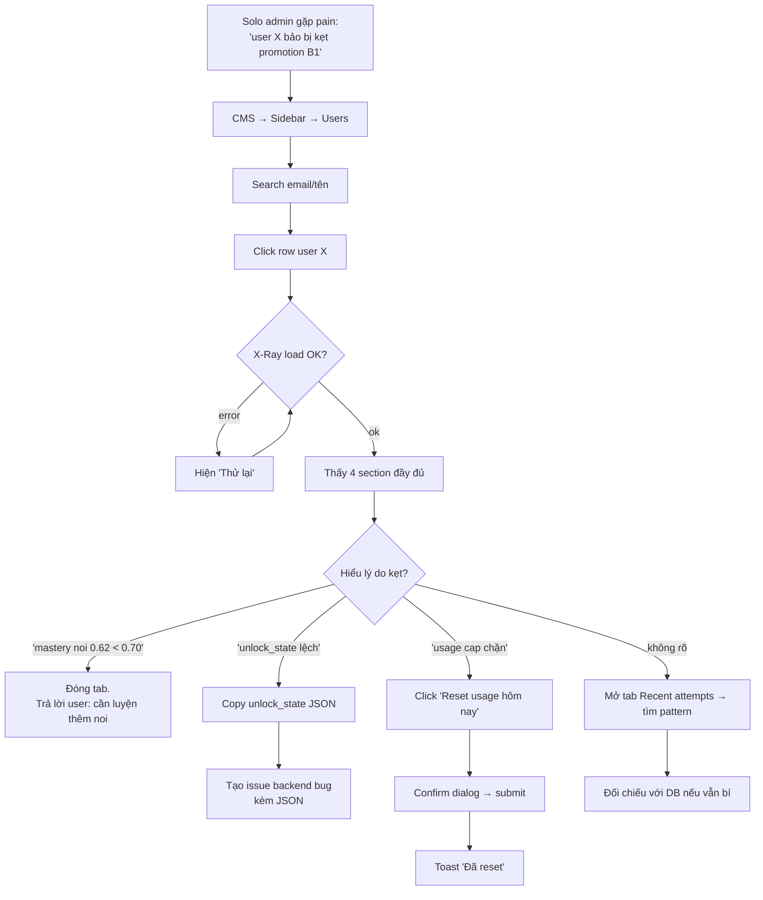
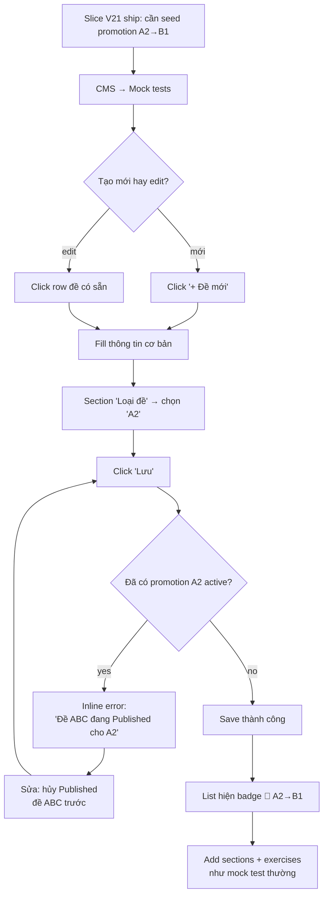
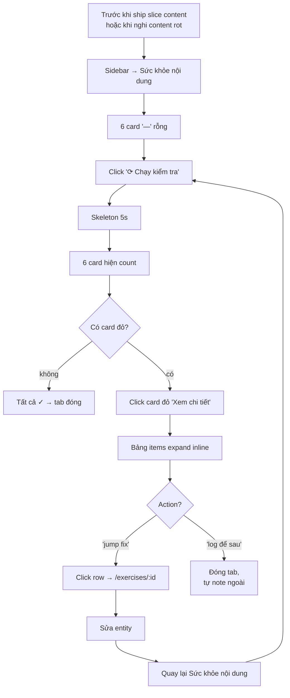

# V22 CMS Catch-Up — Idea + UX + Flow

> **Status**: ✅ promoted to spec on 2026-05-07.
> **Spec authoritative**: `docs/specs/v22-cms-catch-up.md`.
> **Idea kept as historical pre-spec**. Nếu mâu thuẫn, theo spec.
>
> **Schema correction (post-recon)**:
> - Idea giả định cột `promotion_target_level` — **sai**.
> - Schema thật V21 dùng 3 cột: `mock_tests.is_promotion` + `is_placement` + `target_level`,
>   với 2 DB constraint (`mock_tests_promotion_target_required`,
>   `mock_tests_promotion_placement_mutex`).
> - Form CMS đã có sẵn 3 field từ V21 (`mock-test-dashboard.tsx` line 480-521).
>   Spec C thu hẹp: chỉ còn **badge + filter + app-layer "1-published-per-level" validate**.
>
> **Owner**: solo admin (tuananh.ngta@gmail.com).
> **Trigger**: CMS đang chậm 2-3 slice so với learner-facing app
> (V19 mastery → V20 Flutter UI → V21 CEFR/promotion → V21.2 admin
> escape hatch). Ngoài 1 cột "Hôm nay" + Reset usage, CMS chưa biết
> gì về `unlock_state`, `mastery`, `promotion_*`.

---

## 1. Problem Statement

> **HMW** đóng khoảng cách CMS để solo admin theo kịp V21+ feature
> learner-facing — mà không phải chạy SQL trực tiếp khi debug stuck
> learner hoặc seed promotion content?

---

## 2. Recommended Direction

Slice 1 tuần (V22-CMS), 3 task theo thứ tự **B → C → F**, kỷ luật
**read-only V22** cho mọi chế độ debug.

### B. Learner X-Ray (ưu tiên cao nhất)
Click 1 user trên Users list → trang debug đầy đủ trạng thái CEFR:
- `current_level`, `placement_taken_at`, `unlock_state` (pretty JSON)
- `promotion_unlocked` flag, mastery per skill × module
- `promotion_attempts` ledger (lần thi promotion gần đây)
- `daily_usage` hôm nay (kèm reset link sẵn có)
- Recent attempts (20 dòng cuối)

**Đóng pain hằng ngày**: solo admin debug 30 phút SQL → 30 giây UI.

### C. Promotion Exam authoring (gap V21 mới)
Mock-tests page biết field `promotion_target_level`:
- Field enum `[—, A1, A2, B1]` trong form (A0 không có promotion vào)
- Badge "🎯 A2→B1" trong list
- Validate app-layer: mỗi level đúng 1 promotion exam active

Xóa workaround SQL khi seed promotion content.

### F. Content Health Report (phòng ngừa)
Sidebar mục mới "Sức khỏe nội dung". On-demand button "Chạy kiểm tra"
→ 6 check cố định:
1. Orphan exercises (pool=course nhưng `module_id=""`)
2. Missing audio (skill=nghe nhưng `exercise_audio` thiếu)
3. Untested skill (module không có exercise của skill nào)
4. Mock test thiếu section
5. Course thiếu module
6. Dictation thiếu sentence audio

Read-only V22 — không click-to-fix.

---

## 3. Key Assumptions to Validate

- [ ] Backend chưa expose `unlock_state` qua admin route
      (recon confirm: zero hit trong `httpapi/admin_users.go`).
      → cần endpoint mới `GET /v1/admin/users/:id/state`.
- [ ] `mock_tests.promotion_target_level` đã tồn tại sau migration 026
      (V21). **Phải verify trong slice plan**; nếu chưa → migration
      thêm (vẫn trong scope V22-CMS vì là 1 cột).
- [ ] Solo admin OK với read-only V22 (không force-unlock,
      không edit mastery thủ công). Edit-actions defer V23+.
- [ ] Health report on-demand đủ cho V22 (cron defer).
- [ ] CMS deploy có thể release độc lập hoặc gộp với backend slice
      kế tiếp (xác nhận pipeline).

---

## 4. MVP Scope (~5-6 ngày)

### IN
- Backend: 1 endpoint mới `GET /v1/admin/users/:id/state`
  trả về dump tổng hợp (unlock_state, mastery rows, promotion_attempts,
  daily_usage, recent attempts).
- Backend: 6 check rule cho health report (1 endpoint
  `GET /v1/admin/content-health` trả tổng hợp).
- CMS: route mới `app/users/[userId]/page.tsx` + component
  `components/learner-xray.tsx`.
- CMS: extend `mock-test-dashboard.tsx` thêm field
  `promotion_target_level` + badge trong list.
- CMS: route mới `app/content-health/page.tsx` + component
  `components/content-health.tsx`.
- Sidebar: thêm mục "Sức khỏe nội dung".

### OUT
- Edit/force-unlock action trên X-Ray.
- Cron schedule cho health report.
- Click-to-fix trong report (chỉ hiển thị, click→jump source).
- Multi-level promotion (chỉ A2→B1 V22; A1, B1+ defer).
- Generic schema-driven CMS / CLI / AI triage.

---

## 5. Not Doing (and Why)

| Bỏ | Lý do |
|---|---|
| Generic schema-driven CMS (variation D) | UI tự sinh xấu, không tinh chỉnh content workflow đặc thù |
| Process change "Slice-CMS coupling" (E) | Không zero-feature-week tuần này; có thể adopt từ V23 nếu ROI rõ |
| Admin CLI thay CMS (G) | Terminal-only không share, solo admin có thể mở rộng team sau |
| AI Triage button (H) | Bonus, defer V23+ — cần X-Ray cung cấp data input trước |
| Edit actions trên X-Ray V22 | Kỷ luật read-only, tránh scope creep ("force unlock", "reset mastery"…) |
| Cron health report V22 | On-demand đủ cho solo admin; cron khi có team content |

---

## 6. Detailed Requirements

### 6.1 Functional — B: Learner X-Ray

| FR | Yêu cầu |
|---|---|
| FR-B-01 | Route `/users/:userId` mở trang detail. Click row trên Users list điều hướng tới (link mới). |
| FR-B-02 | Backend endpoint `GET /v1/admin/users/:id/state` trả 1 JSON tổng hợp với 5 section (xem 6.4). |
| FR-B-03 | Trang hiển thị 4 section: **Hồ sơ**, **Trạng thái CEFR**, **Mastery**, **Promotion attempts**, **Recent attempts**. |
| FR-B-04 | `unlock_state` hiển thị dạng JSON pretty (mono font, syntax-highlight nhẹ qua CSS class). Có toggle "Show raw / Tóm tắt". |
| FR-B-05 | Mastery hiển thị bảng: `skill_kind × module_id (tên module) × score × attempts_count × updated_at`. Sort theo `updated_at desc`. |
| FR-B-06 | Promotion attempts hiển thị bảng (mới nhất trước): `target_level, score, passed, started_at, completed_at`. |
| FR-B-07 | Recent attempts limit 20 dòng cuối: `exercise (tên rút gọn), skill_kind, score, started_at`. |
| FR-B-08 | Action buttons V22: chỉ "Reset usage hôm nay" (đã có) + "Reset password" (đã có). KHÔNG có button edit khác. |
| FR-B-09 | Loading skeleton ≥ 300ms; error state có nút "Thử lại". |
| FR-B-10 | Breadcrumb: `Users › <email>`. Click "Users" về list. |

### 6.2 Functional — C: Promotion Exam authoring

| FR | Yêu cầu |
|---|---|
| FR-C-01 | Mock test form thêm field `Promotion target level` (Select: `— Không —`, `A1`, `A2`, `B1`). Default `— Không —`. |
| FR-C-02 | Backend `PATCH/POST /v1/admin/mock-tests/:id` chấp nhận `promotion_target_level` (string nullable). |
| FR-C-03 | Validate app-layer khi save: nếu set value khác `null`, query mock test khác có cùng `promotion_target_level` đang `published` → toast error "Đã có promotion exam cho A2. Hủy active mock test {id} trước.". |
| FR-C-04 | Mock test list hiển thị badge `🎯 A2→B1` (orange pill) bên cạnh title nếu có `promotion_target_level`. |
| FR-C-05 | Mock test list filter mới: `Loại = [Tất cả, Thường, Promotion exam]`. |

### 6.3 Functional — F: Content Health Report

| FR | Yêu cầu |
|---|---|
| FR-F-01 | Sidebar thêm mục "Sức khỏe nội dung" (icon: shield-check). |
| FR-F-02 | Trang mặc định: 6 card "—" (chưa run). 1 button to "Chạy kiểm tra". |
| FR-F-03 | Backend `GET /v1/admin/content-health` trả `{ checks: [{id, label, count, items: [{entity_type, entity_id, label, link?}]}] }`. |
| FR-F-04 | Mỗi card hiển thị: title, count (red nếu >0), button "Xem chi tiết" → expand bảng items. |
| FR-F-05 | Click 1 item → jump tới entity gốc (`/exercises/:id`, `/mock-tests/:id`, `/courses/:id`, `/modules/:id`). |
| FR-F-06 | Run check show progress (skeleton + spinner). Result cache trong React state, không persist DB. |

### 6.4 API contract — `GET /v1/admin/users/:id/state`

```json
{
  "user": {
    "id": "...", "email": "...", "display_name": "...",
    "role": "user", "pro_tier": "free",
    "grace_attempts_left": 3,
    "current_level": "a2",
    "placement_taken_at": "2026-04-15T10:23:00Z"
  },
  "daily_usage": {
    "day": "2026-05-07", "attempts_count": 12, "attempts_cap": 30
  },
  "unlock_state": { "a2": { "noi": true, "viet": true }, "b1": { "noi": false } },
  "promotion_unlocked": false,
  "mastery": [
    { "skill_kind": "noi", "module_id": "mod_giao_tiep", "module_label": "Giao tiếp cơ bản",
      "score": 0.74, "attempts_count": 18, "updated_at": "..." }
  ],
  "promotion_attempts": [
    { "id": "...", "target_level": "b1", "score": 0.62, "passed": false,
      "started_at": "...", "completed_at": "..." }
  ],
  "recent_attempts": [
    { "id": "...", "exercise_id": "...", "exercise_label": "Úloha 2 — quán cà phê",
      "skill_kind": "noi", "score": 0.81, "started_at": "..." }
  ]
}
```

### 6.5 Non-functional

| NFR | Tiêu chí |
|---|---|
| NFR-01 | Endpoint `/state` phản hồi p95 < 500ms cho user có ≤ 1k attempts. |
| NFR-02 | Health check endpoint p95 < 3s (acceptable cho on-demand). |
| NFR-03 | A11y: tất cả button có label rõ; bảng có `<th scope>`; contrast text ≥ 4.5:1 (đặc biệt orange pill). |
| NFR-04 | Responsive: desktop ≥ 1280px ưu tiên; tablet 768px usable; mobile defer (admin desk). |
| NFR-05 | Bảo mật: tất cả route mới gate qua `withRole("admin")`. Không leak token user qua response. |
| NFR-06 | Test: backend `_test.go` cho 2 endpoint mới (happy + 404 + non-admin → 403). CMS smoke: render X-Ray với fixture user. |

---

## 7. UI/UX Design

### 7.1 Design tokens (đã có, dùng nguyên)

| Token | Giá trị | Dùng cho |
|---|---|---|
| `--bg` | `#fbf3e7` | Trang nền |
| `--surface` | `#ffffff` | Card, panel |
| `--surface-alt` | `#fff8ea` | Card phụ |
| `--ink` | `#14110c` | Text chính |
| `--ink-2` | `#4d4540` | Text phụ |
| `--ink-3` | `#857b72` | Helper |
| `--brand` | `#ff6a14` | Primary CTA, badge promotion |
| `--brand-soft` | `#ffe5d2` | Pill background |
| `--accent` | `#0f3d3a` | Info/teal badge, link |
| `--accent-soft` | `#d9e5e3` | Info section bg |

Status colors (cần thêm nếu chưa có):
- Success: `#1f7a3d` text on `#dcefe1`
- Warning: `#9a6b00` text on `#fff3cf`
- Danger: `#a8301d` text on `#fbe1dc`

### 7.2 Wireframe — B Learner X-Ray (desktop ≥ 1280px)

```
┌──────────────────────────────────────────────────────────────────────┐
│ [≡ sidebar]  Users › tuananh.ngta@gmail.com               [↩ Quay lại]│
├──────────────────────────────────────────────────────────────────────┤
│                                                                       │
│ ┌─ Hồ sơ ─────────────────────┐  ┌─ Trạng thái CEFR ──────────────┐  │
│ │ Email   tuananh.ngta@…      │  │ Level hiện tại    [A2]         │  │
│ │ Tên     Anh Nguyễn          │  │ Placement         15/04/2026   │  │
│ │ Vai trò user · Pro tier free│  │ Promotion unlock  ❌ Chưa      │  │
│ │ Grace attempts   3          │  │ Hôm nay          12 / 30   ⟲   │  │
│ │ Tạo     03/02/2026          │  │                                │  │
│ └─────────────────────────────┘  └────────────────────────────────┘  │
│                                                                       │
│ ┌─ Unlock state ─────────────────────────────────────────  [JSON ⌄]┐ │
│ │ A2 · noi ✓ · viet ✓ · nghe ✓ · doc ✓ · tu_vung ✓ · ngu_phap ✓   │ │
│ │ B1 · noi ✗ · viet ✗ · nghe ✗ · doc ✗                            │ │
│ │                                                  [Xem JSON gốc] │ │
│ └──────────────────────────────────────────────────────────────────┘ │
│                                                                       │
│ ┌─ Mastery (per skill × module) ───────────────────────────────────┐ │
│ │ Skill      Module                  Score    Attempts  Cập nhật  │ │
│ │ noi        Giao tiếp cơ bản        ▓▓▓▓░ 0.74   18    15:30    │ │
│ │ noi        Đi úřad                 ▓▓▓░░ 0.62   11    14:12    │ │
│ │ viet       Ôn thi A2               ▓▓▓▓▓ 0.88   24    13:01    │ │
│ │ ...                                                              │ │
│ └──────────────────────────────────────────────────────────────────┘ │
│                                                                       │
│ ┌─ Promotion attempts ─────────────────────────────────────────────┐ │
│ │ Target  Score  Kết quả   Bắt đầu          Kết thúc              │ │
│ │ B1      0.62   ❌ Trượt   2026-05-01 10:00  2026-05-01 11:23    │ │
│ │ B1      0.58   ❌ Trượt   2026-04-28 14:00  2026-04-28 15:15    │ │
│ └──────────────────────────────────────────────────────────────────┘ │
│                                                                       │
│ ┌─ Attempt gần đây (20) ───────────────────────────────────────────┐ │
│ │ Bài tập                      Skill    Score    Thời gian        │ │
│ │ Úloha 2 — quán cà phê         noi     0.81    07/05 09:23       │ │
│ │ Cteni 4 — biển hiệu           doc     0.92    07/05 09:10       │ │
│ │ ...                                                              │ │
│ └──────────────────────────────────────────────────────────────────┘ │
│                                                                       │
│ [Reset usage hôm nay]  [Reset password]                               │
└──────────────────────────────────────────────────────────────────────┘
```

**Component anatomy** (xếp theo render order):
- `<XRayHeader breadcrumb actions />`
- `<ProfileCard user />` + `<CefrCard user usage />` (grid 2 col)
- `<UnlockStateCollapsible state />`
- `<MasteryTable rows />`
- `<PromotionAttemptsTable rows />`
- `<RecentAttemptsTable rows />`
- `<AdminActions userId />` (reuse từ users-dashboard hiện có)

### 7.3 Wireframe — C Promotion Authoring

**Mock test form (extend)**

```
┌─ Tin chính ──────────────────────────────────────┐
│ Tiêu đề       [Đề thi A2 → B1 · 2026-Q2     ]   │
│ Slug          [exam-promotion-a2-b1-2026q2  ]   │
│ Mô tả         [...                          ]   │
│ Trạng thái    ( ) Bản nháp  (•) Published       │
│ ┌──────────────────────────────────────────────┐ │
│ │ 🎯 Loại đề (V22 mới)                         │ │
│ │ Promotion target level                       │ │
│ │ ( ) Không phải promotion                     │ │
│ │ ( ) A1   (•) A2  ( ) B1                      │ │
│ │ ⚠ Đã có promotion exam đang Published cho A2:│ │
│ │   "Đề pilot A2→B1 · 2026-Q1". Hủy Published  │ │
│ │   ở đề đó trước nếu muốn chuyển.             │ │
│ └──────────────────────────────────────────────┘ │
│ ...                                              │
│ [Lưu]  [Hủy]                                     │
└──────────────────────────────────────────────────┘
```

**Mock test list (extend)**

```
┌──────────────────────────────────────────────────────────────────┐
│ Đề thi (Mock tests)            [Loại ▼ Tất cả]  [+ Đề mới]       │
├──────────────────────────────────────────────────────────────────┤
│ 🎯 A2→B1  Đề thi A2 → B1 · 2026-Q2          Published   12 mục  │
│           Đề luyện tập tổng hợp · 2026-Q2    Draft       8 mục   │
│ 🎯 A1→A2  Đề pilot A1 → A2                   Published   6 mục   │
│           ...                                                     │
└──────────────────────────────────────────────────────────────────┘
```

Pill style: `background: var(--brand-soft); color: var(--brand-deep);
font-weight: 600; padding: 2px 8px; border-radius: 999px; font-size: 12px;`

### 7.4 Wireframe — F Content Health Report

```
┌──────────────────────────────────────────────────────────────────────┐
│ Sức khỏe nội dung                          [⟳ Chạy kiểm tra (5s)]    │
├──────────────────────────────────────────────────────────────────────┤
│ Lần chạy gần nhất: 07/05/2026 14:23 · 12 vấn đề được phát hiện       │
│                                                                       │
│ ┌──────────────┐ ┌──────────────┐ ┌──────────────┐                   │
│ │ Orphan       │ │ Missing      │ │ Untested     │                   │
│ │ exercises    │ │ audio        │ │ skill        │                   │
│ │     3        │ │     2        │ │     0 ✓      │                   │
│ │ [Xem chi tiết│ │ [Xem chi tiết│ │              │                   │
│ └──────────────┘ └──────────────┘ └──────────────┘                   │
│ ┌──────────────┐ ┌──────────────┐ ┌──────────────┐                   │
│ │ Mock thiếu   │ │ Course thiếu │ │ Dictation    │                   │
│ │ section      │ │ module       │ │ thiếu audio  │                   │
│ │     1        │ │     0 ✓      │ │     6        │                   │
│ │ [Xem chi tiết│ │              │ │ [Xem chi tiết│                   │
│ └──────────────┘ └──────────────┘ └──────────────┘                   │
│                                                                       │
│ ┌─ Orphan exercises (3) ───────────────────────────────────────────┐ │
│ │ ID                  Tên                            Pool          │ │
│ │ ex_a3f...   →       Cteni 5 — bãi đỗ xe            course        │ │
│ │ ex_8b1...   →       Úloha 1 — điện thoại           course        │ │
│ │ ex_f02...   →       Quizcard từ vựng A2            course        │ │
│ └──────────────────────────────────────────────────────────────────┘ │
└──────────────────────────────────────────────────────────────────────┘
```

Card states:
- `count = 0` → muted background (`--surface-alt`), `✓` icon, no button
- `count > 0` → normal surface, count đỏ bold (`--danger-text`), CTA "Xem chi tiết"
- Run đang loading → skeleton 6 card grey

### 7.5 UX checklist (đã apply)

- ✅ Touch target: button "Xem chi tiết" ≥ 44px height (web admin OK với mouse, nhưng mobile fallback)
- ✅ Color không phải kênh duy nhất: badge có icon (✓/❌/🎯), count có dấu, không chỉ màu
- ✅ Loading skeleton thay spinner cho > 300ms
- ✅ Empty state: "Chưa chạy kiểm tra" với CTA primary
- ✅ Error state: nút "Thử lại" + log link (nếu có)
- ✅ Breadcrumb mọi detail page
- ✅ Confirm dialog tái dùng pattern `ConfirmResetUsage` đã có
- ✅ Focus management: sau submit error, focus field invalid đầu tiên (FR-C-03)
- ✅ Aria-live cho toast result (đã có pattern trong users-dashboard)
- ✅ Bảng có `<th scope="col">` + sortable cho mastery (sort updated_at desc default)
- ✅ JSON pretty dùng `<pre><code>` với class CSS, không inject HTML

---

## 8. User Flows

### 8.1 Flow B — Solo admin debug stuck learner



### 8.2 Flow C — Solo admin author promotion exam



### 8.3 Flow F — Solo admin kiểm tra content health



---

## 9. Acceptance Criteria

### B
- [ ] Click row Users list → mở `/users/:id` X-Ray < 1s.
- [ ] X-Ray hiển thị đủ 5 section với fixture user có ≥ 5 mastery rows
      và ≥ 1 promotion attempt.
- [ ] User không có promotion attempt → section render "Chưa có lần thi
      promotion nào" empty state.
- [ ] Non-admin truy cập `/v1/admin/users/:id/state` → 403.
- [ ] Backend test: 1 happy + 1 not-found + 1 forbidden.

### C
- [ ] Form mock test có field `Promotion target level` Select.
- [ ] Save với `promotion_target_level=A2` khi đã có 1 mock published
      A2 khác → toast error rõ.
- [ ] List hiển thị badge orange với mock có `promotion_target_level`.
- [ ] Filter "Loại = Promotion" hoạt động đúng.

### F
- [ ] Click "Chạy kiểm tra" → 6 card cập nhật count trong < 5s.
- [ ] Card có `count=0` hiển thị `✓` muted, no CTA.
- [ ] Click "Xem chi tiết" → bảng items expand, mỗi item link tới
      entity gốc.
- [ ] Refresh trang → card về "—" (không persist V22).

---

## 10. Open Questions

1. **Migration 026 đã có `mock_tests.promotion_target_level` chưa?**
   Block C nếu chưa — cần confirm bằng grep migration files
   trước slice plan.
2. **Cron infra**: backend có scheduler để upgrade F lên cron sau
   V22 không? Nếu chưa, kế hoạch infra ở slice nào?
3. **A0/A1 promotion**: V22 chỉ A2/B1 active. UI có nên hiện disabled
   option `A1` để báo "sẽ có" hay ẩn hẳn?
4. **Health check rule thứ 7+**: ai propose, thêm ở slice nào? Đặt
   threshold 6 cố định cho V22.
5. **Pagination promotion attempts**: > 20 dòng có cần phân trang?
   V22 default limit 20, OK?

---

## 11. Refs

- `docs/specs/v21-cefr-level-progression.md` — V21 spec gốc
- `docs/reference/learner-profile-identity.md` — V17 user model
- `cms/components/users-dashboard.tsx` — pattern reuse
- `backend/internal/httpapi/admin_users.go` — endpoint kế cận
- `CHANGELOG.md` § V21.2 — admin escape hatch ban đầu

---

> **Next**: nếu approve, tạo `tasks/v22-cms-catch-up-plan.md` +
> `tasks/v22-cms-catch-up-todo.md` theo lifecycle AGENTS.md § 3.
