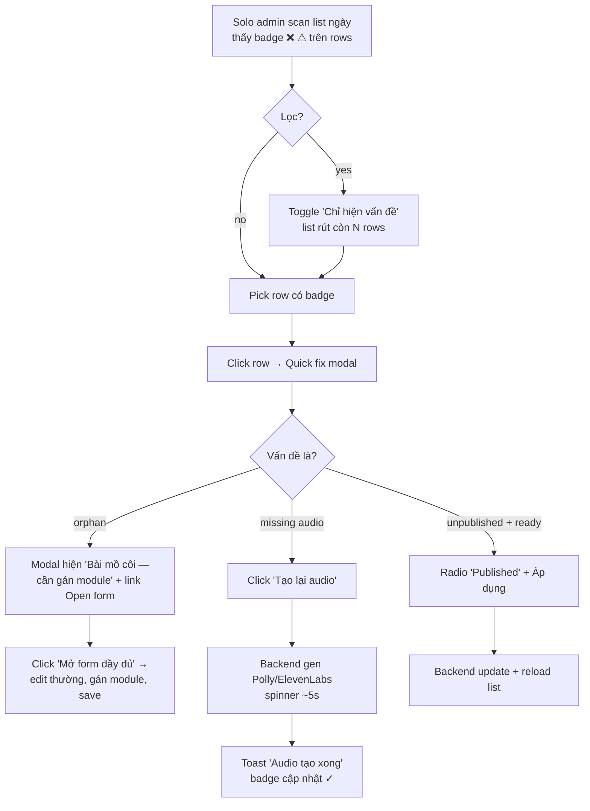

# V23 Exercise Authoring Polish — Idea + Requirements + UX + Flow

> **Status**: ✅ promoted to spec on 2026-05-07.
> **Spec authoritative**: `docs/specs/v23-exercise-authoring-polish.md`.
> **Idea kept as historical pre-spec**. Nếu mâu thuẫn, theo spec.
>
> **User decisions in spec** (recon-resolved):
> - Top 5 preview type: **uloha_1, uloha_2, uloha_3, uloha_4, psani_2_email** (đổi cteni_1 → psani_2 per user pick).
> - Clone audio: **skip hoàn toàn** (admin click regen sau).
> - Quick fix modal: **strict V23** (publish + regen audio only).
> - Backend list response: **inline `validation_flags`** per row.
>
> **Owner**: solo admin (tuananh.ngta@gmail.com).
> **Trigger**: V22 đóng debug + content-health gap, nhưng exercise authoring vẫn chậm. Form 1361 LOC + audio gen per-button + zero preview = chu kỳ tạo bài tập tốn nhiều click + publish-rồi-test. Volume <50 hiện tại tăng nhanh khi seed → cần tools trước khi pain leo thang.

---

## 1. Problem Statement

> **HMW** giúp solo admin tạo + duyệt + bảo đảm chất lượng exercise nhanh hơn — không cần publish-rồi-fix?

3 pain area chính:
1. **Authoring speed**: mỗi bài tập mới đi qua form 1361 LOC, redundant với bài tương tự.
2. **Quality blind spots**: validation chỉ visible qua V22 health-check page; learner-side render không xem được trước publish.
3. **Code health**: 3 list view (dashboard/list/matrix) trùng nhau ~800 LOC, form monolith — defer V24+.

---

## 2. Recommended Direction

3 task theo thứ tự **B → H → C**, scope CMS + 1 backend extension cho H, ~5 ngày tổng.

### B. Quick-Clone (1.5 ngày)
Row action "Sao chép" → fetch source exercise + POST với prefilled fields, share `banner_image_id` + `assets`, **skip `exercise_audio` row** (mỗi bài cần regen vì prompt thay đổi). Title default "Copy of <X>". 5× speed seed bài tập tương tự (4 Úloha 1 chủ đề khác, 5 cteni đoạn văn khác).

### H. Validation Inline Badges (2 ngày)
Backend `/v1/admin/exercises` list response thêm `validation_flags: { missing_audio, missing_sentence_audio, orphan, missing_sample, unpublished }`. Server-side compute (single source of truth, dùng V22 health logic). CMS list mỗi row hiện badge ✓/⚠/❌ tương ứng. Click row → mini fix modal: publish/unpublish + regen audio (no full edit — full edit qua form thường).

### C. Inline Preview Pane MVP (1.5-2 ngày)
Form mở ở `/exercises/[id]/edit` → side-pane phải render learner-side preview cho top 5 exercise type (Úloha 1-4 + Cteni đoạn văn). **Static HTML mô phỏng UI Flutter — không interactive, không pixel-perfect**. Disclaimer "Preview low-fidelity; test trên Flutter trước khi ship". Side-pane collapsible khi width < 1280px.

---

## 3. Key Assumptions to Validate

- [ ] Clone share asset_id (không copy file blob) chấp nhận được — verify với storage code path.
- [ ] Backend list `/v1/admin/exercises` có thể thêm `validation_flags` per row không break existing CMS — verify shape.
- [ ] Top 5 exercise type cover ≥80% authoring volume — verify từ count mỗi type khi seed (V22 content-health rồi đếm).
- [ ] Static HTML preview đủ catch lỗi prompt (Czech text, missing image, broken option list) — admin xác nhận expectation.
- [ ] Inline fix modal V23 chỉ publish/unpublish/regen audio đủ — không cần edit full inline.

---

## 4. MVP Scope (~5 ngày)

### IN
- **B**: row button "Sao chép" + helper `cloneExercisePayload()` + toast confirm
- **H backend**: `validation_flags` field on list response (~80 LOC), reuse V22 content-health logic
- **H CMS**: badge column + ✓/⚠/❌ render + click → mini modal (publish/unpublish + regen audio)
- **C**: side-pane layout + 5 renderer (~150 LOC each) cho top 5 type + collapsible width < 1280px

### OUT
- Bulk action bar (E variation) — defer khi >150 exercises
- Smart filter chips (F) — list filter hiện đã đủ với <50
- Authoring wizard (G) — parallel path = nợ kỹ thuật
- Form monolith split (A) — code health, defer V24
- 3 list view consolidation (D) — code health, defer V24
- 11 type render khác trong preview — defer V24+
- Bulk audio retry (I) — fold vào H modal nếu cần
- Versioning / draft history — defer V25+
- Edit full inline trong validation modal — defer

---

## 5. Detailed Requirements

### 5.1 Functional — B Quick-Clone

| FR | Yêu cầu |
|---|---|
| FR-B-01 | Mỗi row exercise list có button "Sao chép" (icon-copy + label "Sao chép"). Vị trí: cạnh "Sửa" + "Xóa" hiện có. |
| FR-B-02 | Click "Sao chép" → fetch source qua `GET /api/admin/exercises/:id` → POST `/api/admin/exercises` với payload đã transform. |
| FR-B-03 | Clone giữ nguyên: `module_id`, `skill_kind`, `pool`, `exercise_type`, `prompt`, `assets[]`, `banner_image_id`, `sample_answer_text`, `disable_sample_answer`, `estimated_duration_sec`, `prep_time_sec`, `recording_time_limit_sec`, `sample_answer_enabled`, `detail`, `scoring_template_preview`. |
| FR-B-04 | Clone **bỏ** `id` (backend tự sinh), `exercise_audio` row (regen riêng), `status` → "draft". |
| FR-B-05 | Title default `"Copy of " + source.title`. |
| FR-B-06 | Sequence_no: backend tự gán theo module/pool. |
| FR-B-07 | Toast on success: "Đã tạo {new.id} (draft). Edit để hoàn thiện." Click toast → mở form edit row mới. |
| FR-B-08 | Toast on fail: hiện error message từ backend, retry option. |
| FR-B-09 | Button disabled trong khi cloning (busy state). |

### 5.2 Functional — H Validation Inline

| FR | Yêu cầu |
|---|---|
| FR-H-01 | Backend `GET /v1/admin/exercises` response mỗi row thêm `validation_flags: object`. |
| FR-H-02 | 5 flag rule: `missing_audio` (skill=nghe + no exercise_audio), `missing_sentence_audio` (psani_3_dictation + 0 sentence_audio rows), `orphan` (pool=course + module_id=""), `missing_sample` (skill ∈ {noi, viet} + sample_answer_enabled=true + sample_answer_text=""), `unpublished` (status="draft"). |
| FR-H-03 | Mỗi flag là bool. Computed server-side, single source of truth. |
| FR-H-04 | CMS list thêm column "Tình trạng" hiển thị badge cluster: ❌ red cho orphan/missing_audio/missing_sentence_audio, ⚠ yellow cho missing_sample, 📝 grey cho unpublished, ✓ green nếu all-clean. |
| FR-H-05 | Hover badge → tooltip giải thích. |
| FR-H-06 | Filter mới trong list: "Chỉ hiện vấn đề" toggle. Khi on, lọc rows có ít nhất 1 flag true. |
| FR-H-07 | Click row → mini fix modal "Hành động nhanh": (a) Publish/Unpublish toggle, (b) "Tạo lại audio" button (chỉ enable khi skill=nghe hoặc dictation). Edit full → "→ Mở form" link. |
| FR-H-08 | Modal action thành công → reload list, badges cập nhật. |
| FR-H-09 | Backend share helper với V22 content-health (DRY). |

### 5.3 Functional — C Inline Preview

| FR | Yêu cầu |
|---|---|
| FR-C-01 | Khi mở form edit/create, layout chia 2 cột: left form (60%), right preview (40%). |
| FR-C-02 | Width < 1280px → preview collapsible (button "Xem preview" toggle drawer từ phải). |
| FR-C-03 | Preview render real-time theo `form` state (debounce 200ms). |
| FR-C-04 | Top 5 type renderer V23: `uloha_1_topic_answers`, `uloha_2_dialogue_questions`, `uloha_3_story_narration`, `uloha_4_choice_reasoning`, `cteni_1`. 11 type khác hiện placeholder "Preview cho type này chưa hỗ trợ — V24+". |
| FR-C-05 | Renderer Static HTML mô phỏng UI Flutter: card with prompt text + asset image (nếu có) + sample (nếu enabled) + duration label. **Không interactive** — không play audio, không tap button. |
| FR-C-06 | Disclaimer band trên đầu preview: "🔍 Preview low-fidelity. Hãy test trên Flutter trước khi ship." (text khó nhầm). |
| FR-C-07 | Empty state khi form mới: "Bắt đầu nhập để xem preview". |
| FR-C-08 | Preview giữ scroll position khi form rerender. |

### 5.4 Non-functional

| NFR | Tiêu chí |
|---|---|
| NFR-01 | List endpoint p95 < 500ms với `validation_flags` (5 check per row × 50 row = 250 lookup nội bộ). |
| NFR-02 | Preview render < 100ms sau khi form state stabilize. |
| NFR-03 | Clone POST round-trip < 800ms. |
| NFR-04 | A11y: badge có text label + tooltip; ✓/⚠/❌ có icon SVG kèm color (color-not-only). |
| NFR-05 | Responsive: desktop ≥ 1280px ưu tiên; 1024-1279 collapsible preview; <1024 hide preview default. |
| NFR-06 | Test: backend +5 (1 helper test cho mỗi rule trong validation_flags); CMS +12 (clone helper + badge logic + fix modal state machine + preview type guard).

---

## 6. UI/UX Design

### 6.1 Design tokens (reuse từ V22)

Toàn bộ token CSS variables hiện có. Bổ sung 2 token mới cho preview pane:

| Token mới | Giá trị | Dùng cho |
|---|---|---|
| `--preview-bg` | `#f4f1eb` (warmer cream) | Preview side-pane background |
| `--preview-disclaimer` | `#7c4a03` on `#fff8d6` | Disclaimer band |

Color contrast check:
- Badge ❌ on white: `var(--not-ready)` `#a8301d` on `#fbe1dc` ≈ 6.7:1 ✓
- Badge ⚠ on white: `var(--almost)` ≈ 5.2:1 ✓
- Badge 📝 on white: `var(--ink-3)` `#857b72` on `#fff` ≈ 4.6:1 ✓ (border line)
- Badge ✓ on white: `var(--ready)` ≈ 6.5:1 ✓

### 6.2 Wireframe — B Row action

```
┌─ Exercise list (/exercises) ────────────────────────────────────┐
│ Filter: [Khóa học ▼] [Module ▼] [Skill ▼] [Mock ▼] [Tìm…]      │
│ ☐ Chỉ hiện vấn đề   12/47 hiển thị                              │
├──────────────────────────────────────────────────────────────────┤
│ Tình trạng   Tên           Skill   Type           Cập nhật      │
│ ✓           Pocasi 1      noi     uloha_1        15/05  [Sửa] [Sao chép] [Xóa] │
│ ❌ ⚠         Quizcard A2   tu_vung quizcard       14/05  [Sửa] [Sao chép] [Xóa] │
│ 📝          Cteni 5 v2    doc     cteni_5        13/05  [Sửa] [Sao chép] [Xóa] │
└──────────────────────────────────────────────────────────────────┘
```

Hover ❌ → tooltip "Bài tập mồ côi: pool=course nhưng module_id rỗng"

### 6.3 Wireframe — H Quick fix modal

```
┌─ Hành động nhanh: Quizcard A2 ─────────────────────────────────┐
│                                                                 │
│ Tình trạng:                                                     │
│   ❌ Bài tập mồ côi (chưa gán module)                           │
│   ⚠ Thiếu sample answer                                         │
│                                                                 │
│ ┌─ Hành động ──────────────────────────────────────┐           │
│ │ Trạng thái:    ( ) Draft   (•) Published         │           │
│ │ Audio:         [Tạo lại audio] (skill=nghe only) │           │
│ │ Edit chi tiết: → Mở form đầy đủ                  │           │
│ └──────────────────────────────────────────────────┘           │
│                                                                 │
│                                          [Hủy]  [Áp dụng]      │
└─────────────────────────────────────────────────────────────────┘
```

Modal style: reuse pattern `ConfirmResetUsage` từ V21.2.

### 6.4 Wireframe — C Inline preview pane

```
┌─ Edit exercise (/exercises/[id]/edit) ──────────────────────────────────────────────────────┐
│ ← Bài tập › Pocasi 1                                                       [Lưu] [Hủy]      │
├─────────────────────────────────────────────────────────┬────────────────────────────────────┤
│ FORM (60%)                                              │ PREVIEW (40%)                      │
│                                                         │                                    │
│ Title:     [Pocasi 1                              ]    │ 🔍 Preview low-fidelity. Hãy test  │
│                                                         │    trên Flutter trước khi ship.   │
│ Skill:     ( ) noi  (•) viet  …                         │ ─────────────────────────────────  │
│ Type:      [Úloha 1 ▼]                                  │ ┌─ Úloha 1 — Topic answers ────┐  │
│                                                         │ │  Chủ đề: Thời tiết           │  │
│ Prompt JSON:                                            │ │  Thời gian: 90 giây           │  │
│ ┌──────────────────────────────────────────────────┐    │ │                               │  │
│ │ {                                                │    │ │  Câu hỏi 1: Pocasi je dnes?  │  │
│ │   "topic": "Thời tiết",                          │    │ │  Câu hỏi 2: Co je oblečené?  │  │
│ │   "questions": [                                 │    │ │  …                            │  │
│ │     "Pocasi je dnes?",                           │    │ │                               │  │
│ │     ...                                          │    │ │  [🎤 Bắt đầu ghi âm — disabled]│  │
│ │   ]                                              │    │ └───────────────────────────────┘  │
│ │ }                                                │    │                                    │
│ └──────────────────────────────────────────────────┘    │ ☐ Thu gọn preview                 │
│                                                         │                                    │
│ Duration: [90] sec                                      │                                    │
│ ...                                                     │                                    │
└─────────────────────────────────────────────────────────┴────────────────────────────────────┘
```

Width < 1280px:
```
┌─ Edit ─────────────────────────────────┐
│ ← Bài tập › Pocasi 1   [Xem preview]   │
├────────────────────────────────────────┤
│ FORM (full width)                      │
│ ...                                     │
└────────────────────────────────────────┘
```

Click "Xem preview" → drawer slide từ phải, overlay form.

### 6.5 Component anatomy

**B**:
- `<CloneButton exerciseId>` → `cloneExercisePayload(source) → POST → toast` helper
- `<Toast onClick={navigateToEditNew}>`

**H**:
- `<ValidationBadgeCluster flags>` → render up to 4 badges
- `<QuickFixModal exerciseId, flags>` reuse modal frame
- New filter checkbox: `<ProblemOnlyToggle />`

**C**:
- `<SplitLayout left right>` → grid 60/40 desktop, drawer mobile
- `<PreviewDisclaimer />` always visible
- `<PreviewRenderer type, form>` — switch sub-renderer per type
- `<PreviewPlaceholder type>` — for unsupported types

### 6.6 UX checklist (V23 must-meet)

- ✅ Touch target 44×44 cho clone button (icon + label inline, padding 8px+)
- ✅ Color không phải kênh duy nhất: badge có icon (✓/⚠/❌) + text tooltip
- ✅ Loading state rõ: clone busy → spinner, validation modal action → button disabled + label "Đang…"
- ✅ Empty state preview: "Bắt đầu nhập để xem preview"
- ✅ Disclaimer C trong band cao contrast (6.2:1)
- ✅ Focus management: open quick-fix modal → focus đầu radio; close → focus về row
- ✅ Aria-live polite cho toast clone success
- ✅ Keyboard: Tab order trong split-layout đi hết form trước rồi mới preview (preview read-only)
- ✅ Reduced motion: drawer slide < 200ms ease-out, respect `prefers-reduced-motion`
- ✅ Responsive: kiểm trên 1024 / 1280 / 1440

---

## 7. User Flows

### 7.1 Flow B — Solo admin clone bài tập

```mermaid
flowchart TD
    A[Solo admin cần tạo bài tập tương tự<br/>Úloha 1 chủ đề mới] --> B[Mở /exercises]
    B --> C[Tìm bài tập gốc trong list]
    C --> D[Click 'Sao chép']
    D --> E[Fetch source + POST clone]
    E --> F{Status}
    F -- ok --> G[Toast 'Đã tạo {id} draft. Click để sửa']
    G --> H{Click toast?}
    H -- yes --> I[Mở form edit row mới<br/>scrolled to title]
    H -- no --> J[Stay trên list, row mới hiện đầu]
    I --> K[Sửa title + prompt + publish]
    F -- error --> L[Toast error + retry]
    L --> D
```

### 7.2 Flow H — Solo admin sửa nhanh bài có vấn đề



### 7.3 Flow C — Solo admin preview trước publish

```mermaid
flowchart TD
    A[Mở form edit /exercises/[id]/edit] --> B{Width >= 1280px?}
    B -- yes --> C[Layout 60/40 form + preview]
    B -- no --> D[Layout full form + button 'Xem preview']
    C --> E[Sửa prompt JSON]
    D --> F{Click 'Xem preview'?}
    F -- yes --> G[Drawer slide từ phải, overlay form]
    F -- no --> E
    G --> E
    E --> H[Preview rerender debounce 200ms]
    H --> I{Type top 5?}
    I -- yes --> J[Render mock learner card]
    I -- no --> K[Placeholder 'Preview cho type chưa hỗ trợ']
    J --> L{Có lỗi prompt?}
    L -- yes --> M[Sửa form → preview cập nhật real-time]
    L -- no --> N[Submit form / Lưu]
    M --> H
    K --> N
```

---

## 8. Acceptance Criteria

### B
- [ ] Click 'Sao chép' tạo new exercise draft trong < 1s
- [ ] Title mới = `"Copy of " + source.title`
- [ ] Status = "draft"; ID mới
- [ ] Module/skill/type/prompt/assets giữ nguyên
- [ ] Audio record không clone (admin chạy regen riêng)
- [ ] Toast click → navigate edit form bài mới
- [ ] Backend từ chối nếu source không tồn tại (404)

### H
- [ ] List response có `validation_flags` per row
- [ ] 5 rule compute đúng (test mỗi rule)
- [ ] Badge cluster render đúng combo (1 row có thể có nhiều flag)
- [ ] Filter "Chỉ hiện vấn đề" lọc đúng
- [ ] Quick fix modal: publish/unpublish toggle hoạt động
- [ ] "Tạo lại audio" enable đúng (skill=nghe + skill=viet dictation)
- [ ] Modal close → list reload, badges cập nhật

### C
- [ ] Width ≥ 1280: layout 60/40 default
- [ ] Width < 1280: form full + button "Xem preview"
- [ ] Top 5 type render mock card với prompt + duration
- [ ] 11 type khác → placeholder "chưa hỗ trợ"
- [ ] Disclaimer band always visible
- [ ] Debounce 200ms khi form change
- [ ] Empty state khi form trắng

### Slice-level
- [ ] `make verify` xanh
- [ ] V22 content-health logic reused (no duplicate)
- [ ] CHANGELOG entry V23
- [ ] SPEC.md digest row

---

## 9. Open Questions

1. **Backend list response shape**: thêm `validation_flags` inline mỗi row, hay separate `?include=flags` query param? Inline đơn giản hơn, payload tăng nhẹ.
2. **Clone audio policy**: skip hoàn toàn (admin click "Tạo lại audio" sau) hay enqueue async gen ngay khi clone (background)? Skip đơn giản hơn V23.
3. **Top 5 type list**: confirm với volume seed thực tế. Có thể thay `cteni_1` bằng `psani_2_email` nếu admin tạo email writing nhiều.
4. **Quick fix modal scope creep**: nếu admin yêu cầu thêm "Đổi module" hoặc "Đổi skill_kind" inline, defer V24 (full edit qua form thường giữ kỷ luật).
5. **Preview accessibility**: screen reader đọc preview render hay skip? Skip default (preview là visual aid, không content); aria-hidden true.
6. **Drawer responsive 1024-1279**: drawer overlay vs push form? Overlay đơn giản hơn.

---

## 10. References

- V22 spec: `docs/specs/v22-cms-catch-up.md` (content-health logic reuse)
- V22 idea: `docs/ideas/v22-cms-catch-up.md` (variation list — B/C/H/E/F/G origin)
- CMS exercise surface: `cms/components/exercise-list.tsx`, `exercise-form/index.tsx`, `exercise-utils.ts`
- Backend exercise handler: `backend/internal/httpapi/server.go` (handleAdminExercises)
- Audio gen: `backend/internal/processing/exercise_audio.go`
- AGENTS.md § "Documentation Convention" — slice doc lifecycle

---

> **Next**: nếu approve, viết spec `docs/specs/v23-exercise-authoring-polish.md` → plan `tasks/v23-exercise-authoring-polish-plan.md` + todo.
